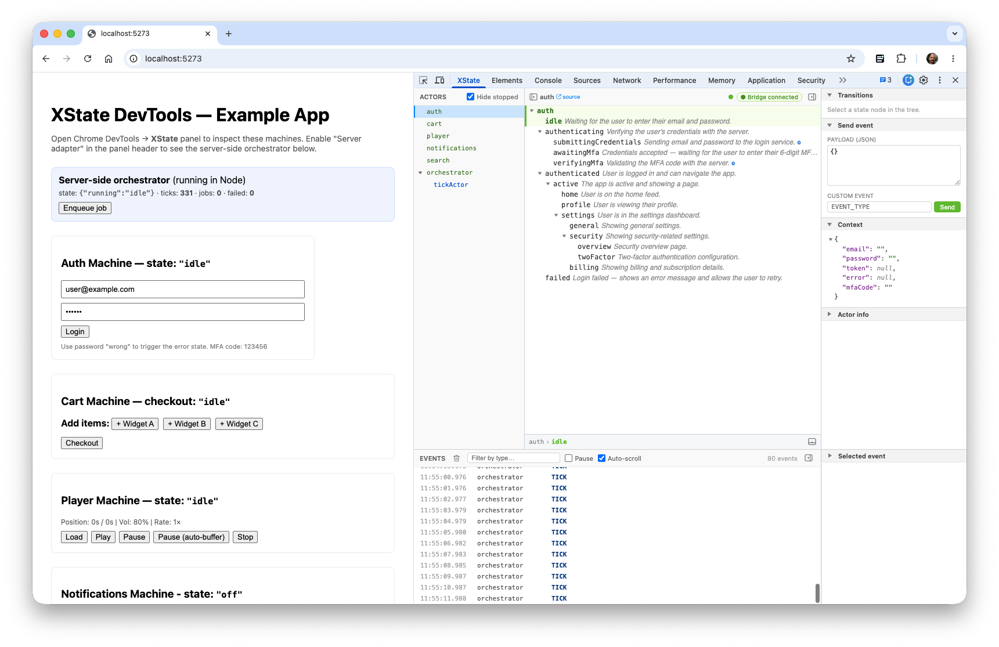

# XState DevTools

Chrome DevTools extension for inspecting XState v5 machines at runtime — both browser-side and Node.js-side actors — with time travel and event dispatch.



## What you get

- **Actor list** with parent → child hierarchy
- **Machine tree** with active-state highlighting and source-link to your editor
- **Active-state breadcrumb** under the title (selected node only)
- **Side panel** with stacked accordion sections: Transitions, Send event, Context (interactive JSON viewer), Status, Actor info
- **Event log** with filter, click-to-time-travel, keyboard stepping (`←`/`→`/`Esc`), and live "back to live"
- **Session export / import** — save the event log to JSON and replay it later, read-only
- **Server-side bridge** — a single `createServerAdapter()` call exposes Node actors to the panel via WebSocket
- **Resizable, collapsible** three-column + drawer layout (Chrome DevTools style)

## Packages

This is an npm-workspaces monorepo:

| Package | Description |
| --- | --- |
| `@xstate-devtools/adapter` | `createAdapter()` (browser) + `createServerAdapter()` (Node) + React helpers — the inspector you wire into your app. |
| `@xstate-devtools/protocol` | The shared wire protocol (serialized machine, snapshots, messages) consumed by every package. |
| `@xstate-devtools/panel-core` | Framework-agnostic debug-panel logic — the inspector store, active-state computation, and session serialization — shared by the chrome panel and the VS Code debugger. |
| `chrome-extension` | Chrome MV3 DevTools extension — service worker, content scripts, and the **XState** panel. |
| [`vscode-extension`](packages/vscode-devtool/README.md) | VS Code extension: **static** analysis (interactive outline + Harel diagram) **and** a **live debugger** that attaches to Node/SSR actors over the server adapter and overlays the running state onto the diagram. |
| `example-remix` | Demo Remix app: client machines + a server orchestrator, wired to the adapter. |

> **Runtime, in two places.** The adapter feeds two consumers. The **chrome-extension** inspects browser **and** Node actors in a DevTools panel. The [**vscode-extension**](packages/vscode-devtool/README.md) does static outline/diagram work **and** — new — attaches to **Node/SSR** actors over the WebSocket server adapter, lighting up the live state on its Harel diagram next to your source. Both share `@xstate-devtools/panel-core`, so the inspection logic is one implementation.

## Quick start

```bash
npm install
npm run build --workspace=packages/chrome-extension
```

Load the extension:
1. `chrome://extensions` → enable **Developer mode**
2. **Load unpacked** → `packages/chrome-extension/dist`

Run the example:
```bash
npm run dev --workspace=packages/example-remix
# open http://localhost:5273
```

Open Chrome DevTools → **XState** panel.

## Wiring it into your app

### Browser-side actors

```ts
// inspector.client.ts (Remix .client.ts is excluded from SSR)
import { createAdapter } from '@xstate-devtools/adapter'
export const { inspect } = createAdapter()
```

```tsx
import { useMachine } from '@xstate/react'
import { inspect } from './inspector.client.js'

const [state, send] = useMachine(myMachine, { inspect })
```

### Server-side actors (Node)

```ts
// inspector.server.ts
import { createServerAdapter } from '@xstate-devtools/adapter/server'

const adapter = (globalThis as any).__inspect__
  ?? ((globalThis as any).__inspect__ = createServerAdapter())
export const { inspect } = adapter
```

```ts
import { createActor } from 'xstate'
import { inspect } from './inspector.server.js'

const actor = createActor(myMachine, { inspect })
actor.start()
```

In the panel header, toggle **Server adapter** on. Default endpoint: `ws://localhost:9301`. Override with the `XSTATE_DEVTOOLS_PORT` env var.

`ws` must be installed by the consumer (peer dep, optional). The browser entrypoint doesn't import it.

## Architecture

```
                 ┌─ window.postMessage ─→ content script ─→ service worker ─┐
 browser actor ──┤                                                          ├→ panel
                 └────────── via injected world:MAIN bridge ────────────────┘

  Node actor ────────── createServerAdapter (WebSocket :9301) ───────────────→ panel
```

- Panel maintains a single zustand store; both transports feed `handleMessage`.
- Inspector tags every `sessionId` with `web:` or `srv:` prefix on outbound, strips it on inbound dispatch — so collisions across processes are impossible.
- Panel rewrites `globalSeq` to a monotonic counter on ingest, so time travel works across both transports.
- Server adapter buffers up to 200 messages until the first panel connects, so actors registered at boot are still visible to a panel that connects late.
- Server adapter and its WS server are cached on `globalThis` to survive Vite/Remix HMR re-evaluation.

## Wire protocol

Defined in `packages/chrome-extension/src/shared/types.ts`. Same protocol on both transports:

- `XSTATE_ACTOR_REGISTERED` — new actor with serialized machine + initial snapshot
- `XSTATE_SNAPSHOT` — snapshot tick (no event)
- `XSTATE_EVENT` — event dispatched + resulting snapshot
- `XSTATE_ACTOR_STOPPED` — actor terminated
- `XSTATE_PERSISTED_SNAPSHOT` — adapter → panel, an actor's XState persisted snapshot (or capture error)
- `XSTATE_DISPATCH` — panel → adapter, send an event to a specific actor
- `XSTATE_REQUEST_PERSISTED` — panel → adapter, request an actor's persisted snapshot
- `XSTATE_RESTORE` — panel → adapter, recreate an actor from a persisted snapshot (live rewind)

## Time travel

- Click any row in the event log → state tree freezes to the post-event snapshot at that point in time
- The time-travel banner shows the selected event's type and timestamp; "Back to live" resumes following live state
- Keyboard: `←` / `→` step to the previous/next event (stepping past the newest returns to live); `Esc` returns to live. Keys are ignored while typing in an input
- Events newer than the selected point are dimmed in the log so the timeline split is visible
- Bounded ring buffer (500 events) — `timeTravelSeq` clamps to the oldest retained event when older entries evict

## Save & replay sessions

- **Export** writes the captured session (actors, snapshots, and the full event log) to a
  JSON file — useful for attaching a bug repro to an issue or sharing it with a teammate
- **Import** loads a session file into the panel as a read-only **replay**: time travel,
  the state tree, and the event log all work, but live messages are ignored and event
  dispatch is disabled until you **Exit replay**
- Exports contain only the retained event window (see the 500-event cap below)
- The event log and Context view use lossy *display* snapshots. For a **restorable** copy
  of a machine's state, open the **Persisted snapshot** section in the side panel and click
  **Capture** — this pulls XState's `getPersistedSnapshot()` from the live actor. Captured
  persisted snapshots are included in session exports (format v2)

## Live rewind (experimental)

Restore a running machine to a previously captured state:

1. In the side panel's **Persisted snapshot** section, click **Capture** to snapshot the
   actor's state (uses XState's `getPersistedSnapshot()`).
2. Later, click **Restore to this state** to recreate the actor from that snapshot.

Restore only works for actors wired with the opt-in hook — it owns the actor instance so it
can recreate it (plain `useMachine` creates its actor once and ignores later snapshot changes).
The hook reads the adapter from `InspectorProvider`, so wrap your app once:

```tsx
// root.tsx — reuse the same adapter your other components pass to `useMachine`
import { InspectorProvider } from '@xstate-devtools/adapter/react'
import { adapter } from './inspector.client.js' // export const adapter = createAdapter()

<InspectorProvider adapter={adapter}>
  <App />
</InspectorProvider>
```

```tsx
// any component — opt this machine into live rewind
import { useRestorableInspectedMachine } from '@xstate-devtools/adapter/react'

const [state, send] = useRestorableInspectedMachine(myMachine)
```

`InspectorProvider` creates and owns an adapter by default; pass `adapter` to reuse an
existing instance (provided adapters aren't disposed on unmount). The `example-remix` app
demonstrates this end to end — the **Player Machine** card is wired with the restorable hook.

Honest caveats — this restores *machine state*, not the outside world:

- The actor is **recreated**, not rewound in place; its `sessionId` changes and subscriptions
  re-fire from the restored state.
- Already-performed **side effects are not undone** — network calls, spawned children, and
  messages sent to parents stay as they were.
- Actors using plain `useInspectedMachine` (or no hook) have no restore handler; the Restore
  button sends the command but nothing happens on the app side.

## Limitations

- Bounded event history (500 events) — older events are evicted; time travel clamps to the oldest retained event
- Session export captures only the retained event window — events evicted before export are not included
- Server adapter requires `ws` to be installed by the consumer (not bundled)
- Machine source-link uses `vscode://file/...` — works in VS Code; other editors need a custom URL handler

## Scripts

```bash
npm test              # run all package tests
npm run build --workspace=packages/chrome-extension
npm run dev --workspace=packages/example-remix
```

## License

MIT
