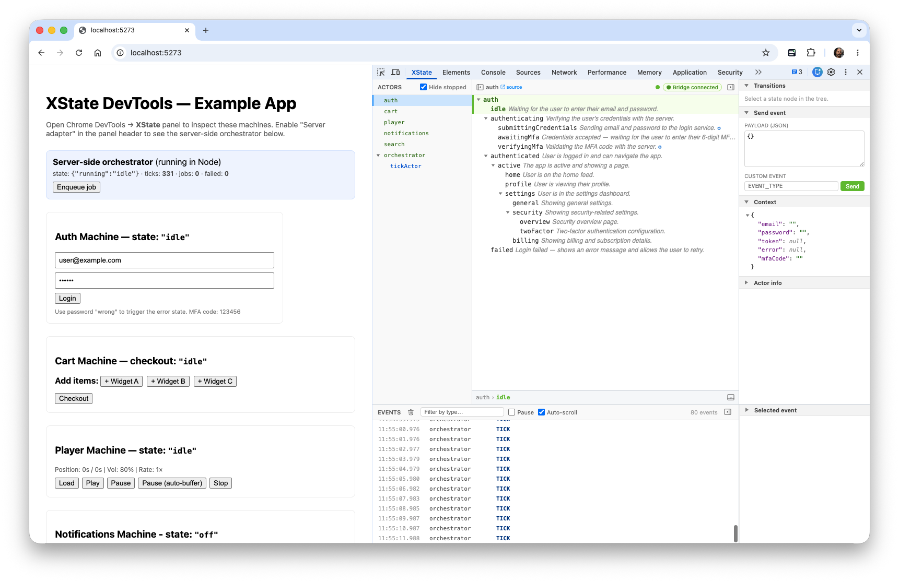

# XState DevTools

**Devtools for XState v5.**

Inspect, debug, and analyse state machines — in the browser, in Node.js, in VS Code, and from AI agents.



## Packages

This is an npm-workspaces monorepo. Pick the package that matches your use case:

| Package | Description |
| --- | --- |
| [`@xstate-devtools/adapter`](packages/adapter/README.md) | Wire XState actors into the devtools. `createAdapter()` for browser actors, `createServerAdapter()` for Node/SSR, plus React helpers (`useMachine`, `useRestorableInspectedMachine`, `InspectorProvider`). |
| [`chrome-extension`](packages/chrome-extension) | Chrome MV3 DevTools extension — service worker, content scripts, and the **XState** panel with actor tree, event log, time travel, and session export/import. |
| [`vscode-devtool`](packages/vscode-devtool/README.md) | VS Code extension: **static analysis** — interactive machine outline, search, navigation, code lens, hover docs, and an editable Harel diagram. |
| [`vscode-debugger`](packages/vscode-debugger/README.md) | VS Code extension: **live debugger** — attaches to Node/SSR actors over the server adapter, inspects context, time-travels the event log, and overlays running state on a Harel diagram. Standalone — works without `vscode-devtool`. |
| [`@xstate-devtools/mcp`](packages/mcp-server/README.md) | Standalone **MCP server** — exposes XState analysis (list / describe / diagram / test-paths / validate) to AI agents over any workspace, no VS Code required. |
| [`vite-plugin`](packages/vite-plugin/README.md) | Vite plugin for integrating the adapter into Vite-based projects. |

### Internal packages

| Package | Description |
| --- | --- |
| `@xstate-devtools/protocol` | Shared wire protocol (serialized machine, snapshots, messages) consumed by every package. |
| `@xstate-devtools/panel-core` | Framework-agnostic debug-panel logic — inspector store, active-state computation, and session serialization — shared by the Chrome panel and VS Code debugger. |
| `diagram-core` | Shared static-analysis and statechart-diagram code (parser, scanner, graph view) bundled by both VS Code extensions and the MCP server. |
| `example-remix` | Demo Remix app: client machines + a server orchestrator, wired to the adapter. |

## Quick start

```bash
npm install
npm run build --workspace=packages/chrome-extension
```

Load the extension:
1. `chrome://extensions` → enable **Developer mode**
2. **Load unpacked** → `packages/chrome-extension/dist`

Run the example:
```bash
npm run dev --workspace=packages/example-remix
# open http://localhost:5273
```

Open Chrome DevTools → **XState** panel.

## Scripts

```bash
npm test                                              # run all package tests
npm run build --workspace=packages/chrome-extension  # build the extension
npm run dev   --workspace=packages/example-remix     # run the demo app
```

## License

MIT
